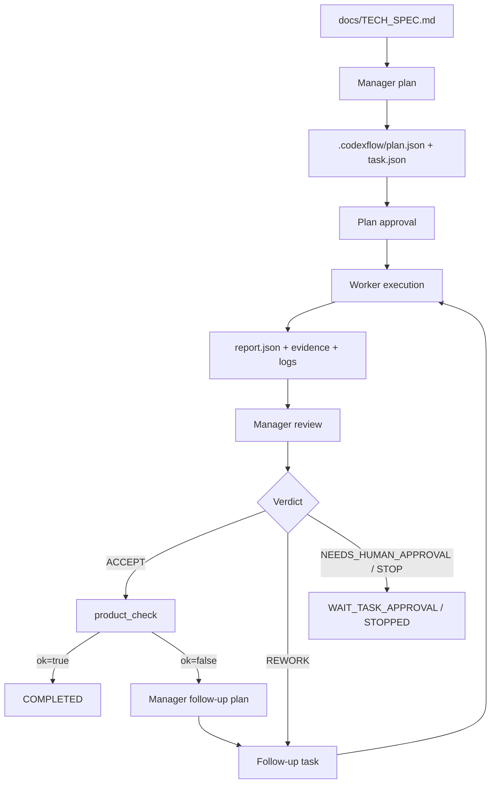

# Dobrovola Codex TwinLoop

This README is the English mirror of the Russian source document:
`docs/TWINLOOP_TWO_AGENT_WORKFLOW_RU.md`.

## 1. What this repository contains

The repository combines two layers:

1. `codexflow/` and `scripts/codexflow*.sh` — the TwinLoop engine, i.e. the two-agent orchestration layer.
2. `jurisparse_un/` — the JurisParse UN microservice that was incrementally built and completed under the control of that orchestration layer from `docs/TECH_SPEC.md`.

The input to the workflow is a microservice technical specification. The output is a reproducible codebase with tests, quality gates, review artifacts, and a formal product-readiness check against the TechSpec.

In the local workspace used for this analysis, a completed run already exists: `RUN-2026-03-05-002`, completed on **March 5, 2026**. In that local runtime state, `.codexflow/state.json` is in phase `COMPLETED`, and `.codexflow/_tmp/product_check.json` reports `ok=true` and `techspec_coverage_pct=100.0`. Those runtime artifacts are normally local-only and git-ignored.

## 2. Functional architecture of the target microservice

To understand the agent workflow, it helps to first see the type of product it is building.

### 2.1. The primary input contract

The primary input document is `docs/TECH_SPEC.md`.

It defines:

- the product domain;
- the MVP boundaries;
- the stage pipeline;
- the CLI contract;
- MongoDB and GCS requirements;
- the mandatory invariants;
- the Definition of Done and readiness checks.

For TwinLoop, this file is not just documentation. It is the canonical product contract that planning, review, quality gates, and final completion all reference.

### 2.2. How JurisParse UN is structured

The microservice is organized as a deterministic stage-based pipeline:

- `jurisparse_un/cli.py` — the CLI surface and pipeline entry point.
- `jurisparse_un/stages/*.py` — the individual processing stages.
- `jurisparse_un/models/ids.py` — deterministic identifiers.
- `jurisparse_un/text/normalize.py` — canonical text normalization.
- `jurisparse_un/storage/contracts.py` — storage path contracts for artifacts.
- `jurisparse_un/db/mongo.py` — the Mongo contract layer.
- `scripts/jurisparse_mvp1_check.py` — the offline product-readiness checker for TechSpec coverage.

Key architectural properties:

- The CLI exposes explicit stage commands: `lookup-sync`, `crawl`, `resolve`, `download`, `extract`, `segment`, `load`, `validate`, `reprocess`, `ingest`, `export-manifest`.
- `ingest` is implemented as a transparent composition of stage modules, not a hidden monolith.
- Stage modules are small functions shaped like `run(...) -> dict`, which makes them easy to test and easy to execute safely in agent loops.
- Identifiers, object paths, and invariants are deterministic so repeated runs are reproducible.
- `reprocess` supports manifest-driven, network-free re-execution of part of the pipeline, which matters for safe agent iterations.
- `validate` checks product-level invariants, not just unit-level conditions.

### 2.3. Why this architecture fits agent-driven development

The codebase is intentionally friendly to autonomous coding:

- the requirements live in one place;
- the product naturally decomposes into small capability slices;
- most checks can be run offline;
- the quality gates are explicit: `ruff`, `pytest`, and `scripts/jurisparse_mvp1_check.py`;
- progress can be measured against formal artifacts and TechSpec coverage instead of intuition.

That is why TwinLoop can move in small iterations without losing control over the product.

## 3. Purpose and logic of the two-agent workflow

### 3.1. What TwinLoop is for

TwinLoop is not meant to be a one-shot code generator. It is designed to drive controlled, incremental product development.

Its purpose is to:

- turn the TechSpec into a sequence of atomic tasks;
- prevent the implementation agent from expanding scope freely;
- require evidence for every iteration;
- measure how much of the TechSpec is actually closed after each accepted task;
- keep iterating until the product-checker confirms completion.

### 3.2. The two roles

The workflow has two agents:

- **Manager / Architect (Agent A)** — runs in `read-only`, does not write code, and only plans, validates, and reviews.
- **Worker / Implementer (Agent B)** — runs in `workspace-write`, edits code, runs checks, and submits a structured report.

The role split is strict:

- the manager does not implement code;
- the worker does not redefine the task or invent requirements;
- coordination happens in repository code, not only inside prompts.

## 4. How the two-agent loop works

### 4.1. High-level flow



### 4.2. Step 0. Preflight

Before any autonomous run, the repository executes:

```bash
python scripts/codexflow.py preflight
```

Preflight checks:

- prompt file availability and readability;
- `codex login` status;
- a schema smoke test for `codex exec`;
- required files and scripts;
- absence of tracked TwinLoop runtime artifacts in git;
- strict JSON-schema contracts;
- the project trust entry in `~/.codex/config.toml`;
- local quality gates `ruff` and `pytest`.

The report is written to `docs/codexflow_preflight_report.md`.

### 4.3. Step 1. The manager generates a plan

Run:

```bash
python scripts/codexflow.py plan
```

The dispatcher:

- reads `docs/TECH_SPEC.md`;
- injects dynamic context from `.codexflow/state.json`;
- runs the manager through `codex exec` in `read-only`;
- requires output that validates against `.codexflow/schemas/manager_plan.schema.json`;
- allows exactly **one active task** in the plan.

This is a core design choice: TwinLoop uses a **rolling single-task** model. At any point in time, the system works on one atomic task, not a large backlog. That sharply reduces scope drift and makes autonomous execution more reliable.

The dispatcher also enforces additional guardrails:

- the task must include explicit product DoD and quality gates;
- critical TechSpec invariants must be present in `dod` and `quality_gates`;
- if the manager misses them, the dispatcher first tries to stabilize the plan by regeneration and can then inject fallback lines if needed.

The critical invariants it insists on include:

- `page_index` is always 1-based;
- reruns do not create duplicates except `ingest_runs`;
- `lookup_sync` does not rely on hardcoded TreatyID/DocTypeID values;
- `needs_ocr=true` means no segments in MVP-1.

### 4.4. Step 2. Plan approval

The plan is not executed immediately. It must be approved:

```bash
python scripts/codexflow.py approve --kind plan
```

Approval is represented by a local marker:

- `.codexflow/approvals/PLAN/approved.marker`

This is simple but important: it separates plan generation from actual execution and makes the process observable and reproducible.

### 4.5. Step 3. The worker executes the task

Main execution:

```bash
python scripts/codexflow.py run
```

During the worker phase, the dispatcher:

- reads `.codexflow/tasks/<task_id>/task.json` and `task.md`;
- builds a prompt with dynamic context;
- runs `codex exec` in `workspace-write`;
- records a `worker.context.json` sidecar;
- waits for a JSON report that must validate against `.codexflow/schemas/worker_report.schema.json`.

The worker is required to:

- stay inside the assigned scope;
- run the `required_commands` listed in the task;
- create git commits with `task_id` in the commit message when possible;
- collect evidence;
- return a structured report rather than free-form prose.

Typical worker artifacts:

- `.codexflow/reports/<task_id>/report.json`
- `.codexflow/reports/<task_id>/report.md`
- `.codexflow/reports/<task_id>/evidence.json`
- `.codexflow/reports/<task_id>/logs/worker.jsonl`
- `.codexflow/reports/<task_id>/logs/worker.stderr.txt`

### 4.6. Step 4. The manager reviews the result

After the worker finishes, a manager-review run starts automatically.

The manager:

- runs again in `read-only`;
- reads the task, the worker report, the evidence, and the logs;
- receives a git summary from the dispatcher;
- returns one of four decisions:
  - `ACCEPT`
  - `REWORK`
  - `NEEDS_HUMAN_APPROVAL`
  - `STOP`

The review stage is also contract-driven:

- the output must validate against `.codexflow/schemas/manager_review.schema.json`;
- the decision is written to `.codexflow/approvals/<task_id>/decision.json` and `decision.md`.

The dispatcher adds another safety layer on top:

- if the manager returns `ACCEPT` without `artifact_checks`, the dispatcher can automatically downgrade the decision to `REWORK`;
- if the manager claims `full_techspec_complete=true` but the worker changed only runtime/report artifacts, the dispatcher forces that flag back to `false`.

### 4.7. Step 5. Product check

`ACCEPT` does not mean the product is complete. After an accepted task, the dispatcher runs `scripts/jurisparse_mvp1_check.py`.

A key architectural choice is that the product-checker runs not against the dirty working tree, but inside a temporary git worktree attached to the accepted commit or branch. This gives three important properties:

- the accepted result is evaluated on a fixed code snapshot;
- local runtime traces do not distort the outcome;
- the check is independently reproducible.

The product-checker returns machine-readable fields such as:

- `ok`
- `missing_requirements`
- `unresolved_requirements`
- `techspec_coverage_pct`
- `machine_ready_for_completion`
- `checked`

If everything is closed, the flow moves to `COMPLETED`.

If gaps remain, TwinLoop does not declare success formally. Instead, it launches another planning pass focused on the residual product deficits.

### 4.8. Step 6. The follow-up loop

This is where the codebase becomes genuinely self-evolving.

The next task is derived from the remaining requirements:

- the manager reads `.codexflow/_tmp/product_check.json`;
- chooses the next smallest, highest-leverage gap;
- emits a new atomic task;
- the worker implements it;
- the manager reviews it;
- the product-checker recomputes TechSpec coverage.

That is how the repository moves from an initial scaffold to a complete implementation.

## 5. Main components and artifacts

### 5.1. The orchestrator

Key files:

- `scripts/codexflow.py` — the CLI entry point for the dispatcher.
- `codexflow/dispatcher.py` — the state machine, phase transitions, and core orchestration logic.
- `codexflow/paths.py` — path conventions inside `.codexflow`.
- `codexflow/codex_runner.py` — `codex exec` integration, retries, stdout/stderr capture.
- `codexflow/render.py` — renders JSON artifacts into Markdown.
- `codexflow/git_ops.py` — safe git operations.
- `codexflow/lock.py` — file locking to prevent concurrent runs.
- `codexflow/io.py` — atomic JSON and text writes.
- `codexflow/models.py` — typed phases and state shapes.

### 5.2. The prompt layer

`.codexflow/prompts/` contains two kinds of prompt files:

- base prompts:
  - `manager_plan.md`
  - `manager_review.md`
  - `worker.md`
- versioned prompts:
  - `Manager_Architect_V_1.1.md`
  - `Worker_Implementer_V_1.1.md`

Right now, `codexflow/paths.py` prefers the versioned v1.1 prompts. That makes prompt evolution manageable: the repository can keep a stable fallback while introducing stricter workflow variants.

### 5.3. The schema layer

`.codexflow/schemas/` defines the machine contracts:

- `manager_plan.schema.json`
- `manager_review.schema.json`
- `worker_report.schema.json`

This layer is what turns the workflow from a loose LLM interaction into a verifiable protocol.

### 5.4. Runtime artifacts

During execution, TwinLoop creates and consumes:

- `.codexflow/state.json` — the current state machine snapshot;
- `.codexflow/plan.json` and `.codexflow/plan.md` — the active plan;
- `.codexflow/tasks/<task_id>/task.json|task.md` — the task definition;
- `.codexflow/reports/<task_id>/...` — the worker result;
- `.codexflow/approvals/<task_id>/...` — the manager review result;
- `.codexflow/_tmp/` — temporary files, product-check output, pids, worktrees, diagnostics;
- `.codexflow/_archive/<timestamp>_<run_id>/...` — archived artifacts from previous runs after `reset`.

Useful sidecar artifacts:

- `*.context.json` — launch metadata including prompt path, prompt sha256, schema path, sandbox, run_id, and task_id.

### 5.5. The evidence layer

The worker is required to submit more than a narrative summary. It must provide evidence:

- the commands actually executed;
- exit codes;
- logs;
- `DoD -> evidence` mapping;
- references to the corresponding TechSpec requirements.

A good example is `.codexflow/reports/TSK-0001/evidence.json`.

It shows how a single task is tied to:

- concrete tests;
- concrete commands;
- concrete TechSpec items;
- the final product-check result.

## 6. How the workflow is organized and stored in the repository

### 6.1. What belongs in git and what stays local

The following should be tracked in git:

- the orchestration code;
- prompt and schema files;
- example JSON files in `.codexflow/examples/`;
- the product code in `jurisparse_un/`;
- tests and the product-check script.

The runtime layer is intentionally git-ignored:

- `.codexflow/state.json`
- `.codexflow/plan.json`
- `.codexflow/plan.md`
- `.codexflow/tasks/`
- `.codexflow/reports/`
- `.codexflow/approvals/`
- `.codexflow/_tmp/`
- `.codexflow/_archive/`
- `.codexflow/**/logs/`

The separation is deliberate:

- the repository stores **the workflow mechanism**;
- the local machine stores **the traces of specific runs**.

### 6.2. How the state machine is represented

`state.json` includes:

- `run_id`
- `phase`
- `active_task`
- `iteration`
- `stall_count`
- `attempts`
- `last_good_commit`
- `approval`
- `history`

This is a full state snapshot, not just a yes/no execution flag.

Main phases:

- `INIT`
- `WAIT_PLAN_APPROVAL`
- `TASK_READY`
- `WORKER_RUNNING`
- `REVIEW_RUNNING`
- `WAIT_TASK_APPROVAL`
- `STOPPED`
- `COMPLETED`
- `FAILED`

### 6.3. How the codebase evolution becomes visible

The evolution of the project is visible not only in the current code, but also in archived task runs.

For example, the local `.codexflow/_archive/.../tasks/` trees show a sequence of capability slices such as:

- bootstrap scaffold;
- storage and Mongo contracts;
- dynamic `lookup_sync`;
- resilience for `crawl/resolve/download`;
- extract/segment invariants;
- idempotent load upserts;
- validate/reprocess gaps.

That is the practical signature of the two-agent workflow: the manager keeps decomposing a large TechSpec into the next atomic step, and the worker keeps extending the codebase with evidence-backed changes.

## 7. How the TechSpec becomes code

The semantic pipeline is:

1. `docs/TECH_SPEC.md` defines architecture, boundaries, and DoD.
2. The manager turns the next unresolved part of the specification into one task.
3. The worker modifies code only within that task boundary.
4. The manager accepts or rejects the task based on evidence.
5. The product-checker measures the remaining gap between repository reality and TechSpec reality.
6. That residual gap becomes the next task.

So the TechSpec serves several roles at once:

- product specification;
- source for task decomposition;
- source for DoD wording;
- source of truth for final completion.

That is what solves a common LLM-development problem: code may exist, but without a mechanism like this it is unclear how much of the original specification it actually closes.

## 8. How to reproduce the workflow in this repository

Minimal sequence:

```bash
python scripts/codexflow.py preflight
python scripts/codexflow.py reset
python scripts/codexflow.py plan
python scripts/codexflow.py approve --kind plan
python scripts/codexflow.py run
python scripts/codexflow.py status
```

For a longer autonomous run:

```bash
bash scripts/codexflow_operational_run.sh
```

For a full smoke pass:

```bash
bash scripts/codexflow_smoke.sh
```

Environment prerequisites:

- Python 3.11+
- `ruff`
- `pytest`
- `codex` CLI in `PATH`
- successful `codex login`
- a trusted project entry in `~/.codex/config.toml`

## 9. How to transfer the workflow to another project

### 9.1. What to copy

The minimum transferable set is:

- `codexflow/`
- `scripts/codexflow.py`
- `scripts/codexflow_operational_run.sh`
- `scripts/codexflow_smoke.sh`
- `.codexflow/prompts/`
- `.codexflow/schemas/`
- `.codexflow/examples/`
- `.gitignore` rules for runtime artifacts

### 9.2. What must be adapted

The following parts must be customized for a new product:

- `docs/TECH_SPEC.md`
- a product-check script analogous to `scripts/jurisparse_mvp1_check.py`
- the manager and worker prompts
- the set of quality gates and `required_commands`
- the base branch and operational supervisor settings
- the README and local run instructions

There are also some built-in conventions to account for:

- the manager schema expects `spec_path == "docs/TECH_SPEC.md"`;
- `FlowPaths.tech_spec` resolves that path directly;
- `FlowPaths.product_check_script` currently points to `scripts/jurisparse_mvp1_check.py`.

The cheapest migration path is:

- keep `docs/TECH_SPEC.md`;
- swap in a project-specific product-checker;
- adapt prompts and examples for the new domain;
- keep most of the orchestration layer unchanged.

### 9.3. A practical migration recipe

1. Copy `codexflow/`, the tracked parts of `.codexflow`, and the shell scripts.
2. Prepare a new `docs/TECH_SPEC.md`.
3. Implement an offline product-checker that returns:
   - `ok`
   - `missing_requirements`
   - `unresolved_requirements`
   - `techspec_coverage_pct`
   - `machine_ready_for_completion`
4. Attach real quality gates for the new repository.
5. Adapt the manager/worker prompts for the new domain while keeping single-task discipline and schema-only output.
6. Make sure runtime artifacts stay out of git.
7. Run `preflight -> plan -> approve -> run`.

### 9.4. What you should not lose during migration

If you want to preserve the workflow rather than only copy some files, you need to keep these principles:

- exactly one active task per iteration;
- the manager is `read-only`;
- the worker is `workspace-write`;
- all exchanges are schema-validated JSON;
- every `ACCEPT` is followed by a product-check;
- evidence is mandatory;
- accepted results are checked on a fixed git ref;
- follow-up tasks come from the residual requirements, not from unconstrained agent improvisation.

If those properties disappear, the workflow quickly degrades into ordinary, unaudited code generation.

## 10. File map

For navigation:

- `README.md` — this English mirror for external readers.
- `docs/TECH_SPEC.md` — the source technical specification.
- `docs/TWINLOOP_TWO_AGENT_WORKFLOW_RU.md` — the Russian original.
- `codexflow/dispatcher.py` — the heart of the state machine.
- `codexflow/paths.py` — path conventions for `.codexflow`.
- `codexflow/codex_runner.py` — `codex exec` integration.
- `.codexflow/prompts/*.md` — the two agent prompts.
- `.codexflow/schemas/*.json` — the agent message contracts.
- `.codexflow/examples/*.json` — examples of valid agent outputs.
- `scripts/codexflow_operational_run.sh` — the autonomous supervisor mode.
- `scripts/codexflow_smoke.sh` — the full smoke-run scenario.
- `scripts/jurisparse_mvp1_check.py` — the product readiness checker.
- `jurisparse_un/` — the microservice code.
- `tests/` — tests for the product and the orchestration layer.

## 11. Summary

In this repository, TwinLoop is implemented as a strict, autonomous TechSpec-driven development loop, not as a casual conversation with an LLM.

Its defining properties are:

- the specification is the primary source of tasks;
- planner and implementer are strictly separated by role and permissions;
- every step leaves machine-checkable artifacts;
- completion is determined by product-check, not by subjective confidence;
- the architecture is modular enough to be transplanted into other repositories.

That is what allows the workflow not only to generate an initial scaffold, but to iteratively bring a codebase to a state that is reproducible, auditable, and adaptable to another project.
