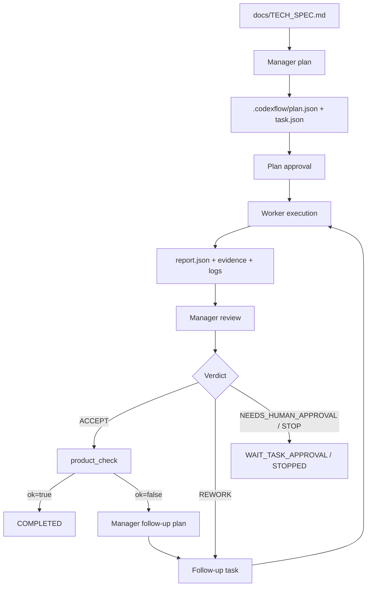

# TwinLoop в этом репозитории: архитектура проекта и двухагентный workflow автокодирования

## 1. Что именно находится в этом репозитории

Репозиторий объединяет два слоя:

1. `codexflow/` и `scripts/codexflow*.sh` — движок TwinLoop, то есть оркестратор двухагентной разработки.
2. `jurisparse_un/` — микросервис JurisParse UN, который был поэтапно собран и доведён до готовности под управлением этого оркестратора на основе `docs/TECH_SPEC.md`.

Вход схемы — техническая спецификация микросервиса. Выход — воспроизводимая кодовая база с тестами, quality gates, review-артефактами и формальным подтверждением соответствия TechSpec.

В локальной рабочей копии, использованной для этого анализа, уже присутствуют артефакты завершённого прогона `RUN-2026-03-05-002` от **5 марта 2026 года**: `.codexflow/state.json` находится в фазе `COMPLETED`, а `.codexflow/_tmp/product_check.json` содержит `ok=true` и `techspec_coverage_pct=100.0`. Эти runtime-артефакты обычно не коммитятся и хранятся только локально.

## 2. Функциональная архитектура целевого микросервиса

Чтобы понять агентный workflow, сначала нужно видеть, какой тип продукта он строит.

### 2.1. Основной входной контракт

Главный входной документ — `docs/TECH_SPEC.md`.

Он задаёт:

- предметную область;
- границы MVP;
- состав stage-пайплайна;
- требования к CLI;
- требования к MongoDB и GCS;
- обязательные инварианты;
- Definition of Done и критерии готовности.

Для TwinLoop этот файл играет роль не просто документации, а канонического продукта-контракта. Именно относительно него строятся задачи, quality gates, review и финальный product-check.

### 2.2. Как устроен JurisParse UN

Микросервис организован как детерминированный stage-based pipeline:

- `jurisparse_un/cli.py` — CLI-оболочка и вход в пайплайн.
- `jurisparse_un/stages/*.py` — отдельные стадии обработки.
- `jurisparse_un/models/ids.py` — детерминированные идентификаторы.
- `jurisparse_un/text/normalize.py` — каноническая нормализация текста.
- `jurisparse_un/storage/contracts.py` — контракт путей артефактов в storage.
- `jurisparse_un/db/mongo.py` — контракт Mongo-слоя.
- `scripts/jurisparse_mvp1_check.py` — offline-checker полноты реализации по TechSpec.

Ключевые свойства этой архитектуры:

- CLI построен вокруг явных stage-команд: `lookup-sync`, `crawl`, `resolve`, `download`, `extract`, `segment`, `load`, `validate`, `reprocess`, `ingest`, `export-manifest`.
- `ingest` реализован как прозрачная композиция stage-модулей, без скрытой магии.
- stage-модули оформлены как небольшие функции `run(...) -> dict`, что удобно и для тестов, и для агентного исполнения.
- идентификаторы, object paths и инварианты сделаны детерминированными, чтобы повторные прогоны были воспроизводимыми.
- `reprocess` позволяет повторять часть пайплайна по manifest без сети, что особенно важно для безопасных агентных итераций.
- `validate` проверяет продуктовые инварианты, а не только локальные unit-level условия.

### 2.3. Почему такая архитектура хорошо подходит для агентной разработки

Эта кодовая база специально удобна для автономного автокодирования:

- требования собраны в одном месте;
- код естественно делится на атомарные capability slices;
- большинство проверок можно запускать офлайн;
- есть явные quality gates: `ruff`, `pytest`, `scripts/jurisparse_mvp1_check.py`;
- результат можно оценивать не по впечатлению, а по формальным артефактам и покрытию TechSpec.

Благодаря этому TwinLoop может развивать проект небольшими итерациями и при этом не терять управляемость.

## 3. Назначение и логика двухагентной схемы

### 3.1. Для чего нужен TwinLoop

TwinLoop нужен не для одноразовой генерации исходников, а для контролируемого инкрементального развития продукта.

Его задача:

- превратить TechSpec в серию атомарных задач;
- запретить исполнителю произвольно расширять scope;
- требовать доказательства по каждому шагу;
- после каждой принятой задачи измерять, насколько репозиторий приблизился к полной готовности по TechSpec;
- продолжать цикл до тех пор, пока product-check не подтвердит завершённость.

### 3.2. Роли двух агентов

В схеме два агента:

- **Manager / Architect (Agent A)** — работает в `read-only`, не пишет код, а только планирует, валидирует и ревьюит.
- **Worker / Implementer (Agent B)** — работает в `workspace-write`, пишет код, запускает проверки и сдаёт структурированный отчёт.

Разделение ролей жёсткое:

- manager не вмешивается в реализацию;
- worker не перепланирует задачу и не «додумывает» требования;
- координацию выполняет отдельный диспетчер в коде репозитория.

## 4. Как работает двухагентный цикл

### 4.1. Общая схема



### 4.2. Шаг 0. Preflight

Перед любым автономным запуском выполняется:

```bash
python scripts/codexflow.py preflight
```

Preflight проверяет:

- доступность prompt-файлов;
- статус `codex login`;
- schema-smoke для `codex exec`;
- наличие обязательных файлов и скриптов;
- отсутствие runtime-артефактов TwinLoop в git;
- строгость JSON-schema контрактов;
- trust-настройку проекта в `~/.codex/config.toml`;
- локальные quality gates `ruff` и `pytest`.

Результат пишется в `docs/codexflow_preflight_report.md`.

### 4.3. Шаг 1. Manager строит план

Запуск:

```bash
python scripts/codexflow.py plan
```

Что делает диспетчер:

- читает `docs/TECH_SPEC.md`;
- добавляет динамический контекст из `.codexflow/state.json`;
- вызывает manager через `codex exec` в `read-only` sandbox;
- требует, чтобы output строго соответствовал `.codexflow/schemas/manager_plan.schema.json`;
- допускает в плане только **одну активную задачу**.

Это принципиальное решение: TwinLoop использует модель **rolling single-task**. В каждый момент времени система ведёт только одну атомарную задачу, а не backlog из десятков пунктов. Это резко упрощает контроль scope и повышает вероятность корректного автономного прохода.

Дополнительные guardrails реализованы в самом диспетчере:

- task должен явно содержать product-DoD и quality gates;
- в `dod` и `quality_gates` должны быть явно отражены критические инварианты TechSpec;
- если manager их пропустил, диспетчер сначала пытается стабилизировать план повторной генерацией, а затем при необходимости дополняет fallback-строками.

Критические инварианты, которые принудительно отслеживаются:

- `page_index` всегда 1-based;
- повторный прогон не создаёт дубликатов, кроме `ingest_runs`;
- `lookup_sync` не использует hardcoded TreatyID/DocTypeID;
- `needs_ocr=true` в MVP-1 означает отсутствие сегментов.

### 4.4. Шаг 2. Approval плана

План не исполняется автоматически. Его нужно одобрить:

```bash
python scripts/codexflow.py approve --kind plan
```

Approval оформляется локальным маркером:

- `.codexflow/approvals/PLAN/approved.marker`

Это простая, но важная конструкция: она отделяет генерацию плана от фактического запуска и делает процесс воспроизводимым и наблюдаемым.

### 4.5. Шаг 3. Worker исполняет задачу

Основной запуск:

```bash
python scripts/codexflow.py run
```

На worker-этапе диспетчер:

- читает `.codexflow/tasks/<task_id>/task.json` и `task.md`;
- подготавливает prompt с динамическим контекстом;
- запускает `codex exec` в `workspace-write`;
- пишет execution sidecar `worker.context.json`;
- ждёт JSON-отчёт по схеме `.codexflow/schemas/worker_report.schema.json`.

Worker обязан:

- работать только в пределах выданного scope;
- запускать `required_commands`, перечисленные в задаче;
- при возможности создавать git commit с `task_id` в сообщении;
- собирать evidence;
- возвращать не prose, а структурированный отчёт.

Типовые артефакты worker:

- `.codexflow/reports/<task_id>/report.json`
- `.codexflow/reports/<task_id>/report.md`
- `.codexflow/reports/<task_id>/evidence.json`
- `.codexflow/reports/<task_id>/logs/worker.jsonl`
- `.codexflow/reports/<task_id>/logs/worker.stderr.txt`

### 4.6. Шаг 4. Manager делает review

После worker автоматически запускается manager-review.

Manager:

- работает снова в `read-only`;
- читает task, report, evidence и логи;
- получает git summary от диспетчера;
- возвращает одно из четырёх решений:
  - `ACCEPT`
  - `REWORK`
  - `NEEDS_HUMAN_APPROVAL`
  - `STOP`

Review тоже идёт по жёсткому контракту:

- ответ должен соответствовать `.codexflow/schemas/manager_review.schema.json`;
- решение сохраняется в `.codexflow/approvals/<task_id>/decision.json` и `decision.md`.

Диспетчер добавляет поверх этого собственные safety checks:

- если manager выдал `ACCEPT` без `artifact_checks`, решение может быть автоматически downgraded до `REWORK`;
- если manager заявил `full_techspec_complete=true`, но worker изменил только runtime/report-артефакты, диспетчер принудительно сбрасывает флаг в `false`.

### 4.7. Шаг 5. Product check

`ACCEPT` ещё не означает завершённость продукта. После него диспетчер запускает `scripts/jurisparse_mvp1_check.py`.

Ключевой архитектурный момент: product-check выполняется не по «грязному» рабочему дереву, а в отдельном временном git worktree, привязанном к принятому commit или branch. Это даёт три свойства:

- оценка идёт по зафиксированному состоянию кода;
- локальные runtime-следы не искажают результат;
- проверку можно воспроизводить независимо от текущей сессии.

Product-check возвращает машинный результат:

- `ok`
- `missing_requirements`
- `unresolved_requirements`
- `techspec_coverage_pct`
- `machine_ready_for_completion`
- `checked`

Если всё закрыто, состояние переводится в `COMPLETED`.

Если пробелы остались, TwinLoop не объявляет успех формально, а инициирует следующий planning pass именно по остаточным дефицитам.

### 4.8. Шаг 6. Follow-up loop

Здесь и проявляется механизм «саморазвития» кодовой базы.

Следующая задача строится не произвольно, а из остатка требований:

- manager получает `.codexflow/_tmp/product_check.json`;
- выбирает следующий минимальный, но наиболее полезный разрыв;
- формирует новую атомарную задачу;
- worker реализует её;
- manager снова ревьюит;
- product-check пересчитывает покрытие TechSpec.

Так проект постепенно проходит путь от первичного scaffold к полноценной реализации.

## 5. Основные компоненты и артефакты схемы

### 5.1. Оркестратор

Ключевые файлы:

- `scripts/codexflow.py` — CLI entrypoint диспетчера.
- `codexflow/dispatcher.py` — главное состояние, переходы фаз и orchestration logic.
- `codexflow/paths.py` — соглашения по путям внутри `.codexflow`.
- `codexflow/codex_runner.py` — запуск `codex exec`, ретраи, stdout/stderr capture.
- `codexflow/render.py` — рендеринг JSON-артефактов в Markdown.
- `codexflow/git_ops.py` — безопасные git-операции.
- `codexflow/lock.py` — file lock против параллельных запусков.
- `codexflow/io.py` — атомарная запись JSON и текста.
- `codexflow/models.py` — типы фаз и состояния.

### 5.2. Prompt-слой

В `.codexflow/prompts/` лежат два типа prompt-файлов:

- базовые:
  - `manager_plan.md`
  - `manager_review.md`
  - `worker.md`
- versioned:
  - `Manager_Architect_V_1.1.md`
  - `Worker_Implementer_V_1.1.md`

Сейчас `codexflow/paths.py` предпочитает versioned v1.1-варианты. Это удобно для эволюции workflow: можно хранить стабильный fallback и отдельно выпускать более строгие prompt-версии.

### 5.3. Schema-слой

Схемы в `.codexflow/schemas/` задают машинные контракты:

- `manager_plan.schema.json`
- `manager_review.schema.json`
- `worker_report.schema.json`

Именно этот слой превращает двухагентный workflow из «диалога с LLM» в проверяемый протокол.

### 5.4. Runtime-артефакты

Во время работы TwinLoop создаёт и использует:

- `.codexflow/state.json` — текущее состояние автомата;
- `.codexflow/plan.json` и `.codexflow/plan.md` — активный план;
- `.codexflow/tasks/<task_id>/task.json|task.md` — постановка задачи;
- `.codexflow/reports/<task_id>/...` — результат worker;
- `.codexflow/approvals/<task_id>/...` — результат manager review;
- `.codexflow/_tmp/` — временные файлы, product-check, pid, worktrees, диагностика;
- `.codexflow/_archive/<timestamp>_<run_id>/...` — архивы предыдущих прогонов после `reset`.

Полезные sidecar-артефакты:

- `*.context.json` — зафиксированные metadata запуска: prompt path, sha256 prompt, schema path, sandbox, run_id и task_id.

### 5.5. Evidence-слой

Worker обязан сдавать не только summary, но и доказательства:

- список реально выполненных команд;
- exit codes;
- логи;
- mapping `DoD -> evidence`;
- ссылки на соответствующие пункты TechSpec.

Хороший пример формата — `.codexflow/reports/TSK-0001/evidence.json`.

По нему видно, как одна задача связывается с:

- конкретными тестами;
- конкретными командами;
- конкретными требованиями TechSpec;
- итогом product-check.

## 6. Как workflow организован и хранится в репозитории

### 6.1. Что хранится в git, а что остаётся локальным runtime

В git должны жить:

- код оркестратора;
- prompt- и schema-файлы;
- примеры JSON в `.codexflow/examples/`;
- продуктовый код `jurisparse_un/`;
- тесты и product-check script.

Runtime-слой специально исключён из git через `.gitignore`:

- `.codexflow/state.json`
- `.codexflow/plan.json`
- `.codexflow/plan.md`
- `.codexflow/tasks/`
- `.codexflow/reports/`
- `.codexflow/approvals/`
- `.codexflow/_tmp/`
- `.codexflow/_archive/`
- `.codexflow/**/logs/`

Смысл разделения:

- репозиторий хранит **механику схемы**;
- локальная машина хранит **следы конкретных прогонов**.

### 6.2. Как устроено состояние

`state.json` хранит:

- `run_id`
- `phase`
- `active_task`
- `iteration`
- `stall_count`
- `attempts`
- `last_good_commit`
- `approval`
- `history`

То есть это полноценный state machine snapshot, а не просто флаг «выполняется / не выполняется».

Основные фазы:

- `INIT`
- `WAIT_PLAN_APPROVAL`
- `TASK_READY`
- `WORKER_RUNNING`
- `REVIEW_RUNNING`
- `WAIT_TASK_APPROVAL`
- `STOPPED`
- `COMPLETED`
- `FAILED`

### 6.3. Как видно развитие кодовой базы

Эволюцию TwinLoop хорошо видно по архивам прогонов и задачам.

Например, в локальных архивах `.codexflow/_archive/.../tasks/` можно проследить последовательность capability slices:

- bootstrap scaffold;
- storage и Mongo contracts;
- dynamic `lookup_sync`;
- resilience для `crawl/resolve/download`;
- extract/segment инварианты;
- idempotent load upserts;
- validate/reprocess gaps.

Это и есть практическое подтверждение двухагентной схемы: manager дробит большой TechSpec на следующие атомарные шаги, а worker по ним последовательно развивает кодовую базу.

## 7. Как TechSpec превращается в код

Смысловой конвейер выглядит так:

1. `docs/TECH_SPEC.md` задаёт архитектуру, границы и DoD.
2. Manager превращает незакрытый фрагмент спецификации в один ближайший task.
3. Worker меняет код только в рамках этой задачи.
4. Manager принимает или возвращает задачу на доработку по evidence.
5. Product-check измеряет остаточный разрыв между репозиторием и TechSpec.
6. Из этого разрыва автоматически рождается следующий task.

Поэтому TechSpec здесь выполняет сразу несколько ролей:

- product specification;
- источник decomposition на задачи;
- источник формулировок DoD;
- эталон финальной готовности.

Это решает типичную проблему LLM-разработки, когда код «вроде бы написан», но непонятно, насколько он реально закрывает исходные требования.

## 8. Как воспроизвести этот workflow в текущем проекте

Минимальная последовательность:

```bash
python scripts/codexflow.py preflight
python scripts/codexflow.py reset
python scripts/codexflow.py plan
python scripts/codexflow.py approve --kind plan
python scripts/codexflow.py run
python scripts/codexflow.py status
```

Для длительного автономного режима:

```bash
bash scripts/codexflow_operational_run.sh
```

Для smoke-прохода полного цикла:

```bash
bash scripts/codexflow_smoke.sh
```

Что нужно в окружении:

- Python 3.11+
- `ruff`
- `pytest`
- `codex` CLI в `PATH`
- успешный `codex login`
- доверенный проект в `~/.codex/config.toml`

## 9. Как перенести схему в другой проект

### 9.1. Что переносить обязательно

Минимальный переносимый набор:

- `codexflow/`
- `scripts/codexflow.py`
- `scripts/codexflow_operational_run.sh`
- `scripts/codexflow_smoke.sh`
- `.codexflow/prompts/`
- `.codexflow/schemas/`
- `.codexflow/examples/`
- правила `.gitignore` для runtime-артефактов

### 9.2. Что нужно адаптировать

Под новый проект обязательно меняются:

- `docs/TECH_SPEC.md`
- product-check script по образцу `scripts/jurisparse_mvp1_check.py`
- prompt-тексты manager и worker
- набор quality gates и `required_commands`
- базовая ветка для merge и operational supervisor
- README и локальные run-инструкции

Есть и жёстко зашитые соглашения, которые важно учесть:

- manager schema ожидает `spec_path == "docs/TECH_SPEC.md"`;
- `FlowPaths.tech_spec` смотрит именно туда;
- `FlowPaths.product_check_script` сейчас указывает на `scripts/jurisparse_mvp1_check.py`.

Самый дешёвый перенос:

- сохранить путь `docs/TECH_SPEC.md`;
- заменить product-check script на свой;
- адаптировать prompts и examples под новый продукт;
- оставить сам orchestration layer почти без изменений.

### 9.3. Практический рецепт переноса

1. Перенести `codexflow/`, tracked-части `.codexflow` и shell-скрипты.
2. Подготовить новый `docs/TECH_SPEC.md`.
3. Реализовать offline product-checker, который возвращает:
   - `ok`
   - `missing_requirements`
   - `unresolved_requirements`
   - `techspec_coverage_pct`
   - `machine_ready_for_completion`
4. Привязать к проекту реальные quality gates.
5. Адаптировать prompts manager/worker под новый домен, но сохранить single-task discipline и schema-only output.
6. Убедиться, что runtime-артефакты не трекаются git.
7. Запустить `preflight -> plan -> approve -> run`.

### 9.4. Что нельзя потерять при переносе

Если переносить не только файлы, но и саму механику, надо сохранить следующие принципы:

- одна активная задача на итерацию;
- manager работает только в `read-only`;
- worker работает только в `workspace-write`;
- все обмены идут через schema-validated JSON;
- после каждого `ACCEPT` выполняется product-check;
- evidence обязателен;
- принятый результат проверяется на фиксированном git ref;
- follow-up задача строится из остатка требований, а не из свободной импровизации агента.

Если убрать эти свойства, схема быстро превращается в обычную непроверяемую генерацию кода.

## 10. Карта связанных файлов

Для навигации по репозиторию:

- `README.md` — английская зеркальная версия этого описания для внешних читателей.
- `docs/TECH_SPEC.md` — исходная техническая спецификация.
- `docs/TWINLOOP_TWO_AGENT_WORKFLOW_RU.md` — русский оригинал.
- `codexflow/dispatcher.py` — сердце state machine.
- `codexflow/paths.py` — соглашения по структуре `.codexflow`.
- `codexflow/codex_runner.py` — интеграция с `codex exec`.
- `.codexflow/prompts/*.md` — prompts двух агентов.
- `.codexflow/schemas/*.json` — контракты агентных сообщений.
- `.codexflow/examples/*.json` — примеры корректных JSON-ответов.
- `scripts/codexflow_operational_run.sh` — автономный supervisor-режим.
- `scripts/codexflow_smoke.sh` — smoke-сценарий полного цикла.
- `scripts/jurisparse_mvp1_check.py` — измеритель готовности продукта.
- `jurisparse_un/` — код микросервиса.
- `tests/` — тесты продукта и оркестратора.

## 11. Вывод

В этом репозитории TwinLoop реализован как строгий автономный контур разработки по TechSpec, а не как свободный диалог с LLM.

Его ключевые свойства:

- спецификация является главным источником задач;
- planner и implementer жёстко разведены по ролям и правам;
- каждый шаг оставляет машинно-проверяемые артефакты;
- завершённость определяется product-check, а не субъективной оценкой;
- архитектура достаточно модульна, чтобы быть перенесённой в другие проекты.

За счёт этого схема способна не только сгенерировать стартовый scaffold, но и последовательно довести кодовую базу до состояния, которое можно воспроизвести, проверить и адаптировать в другом репозитории.
